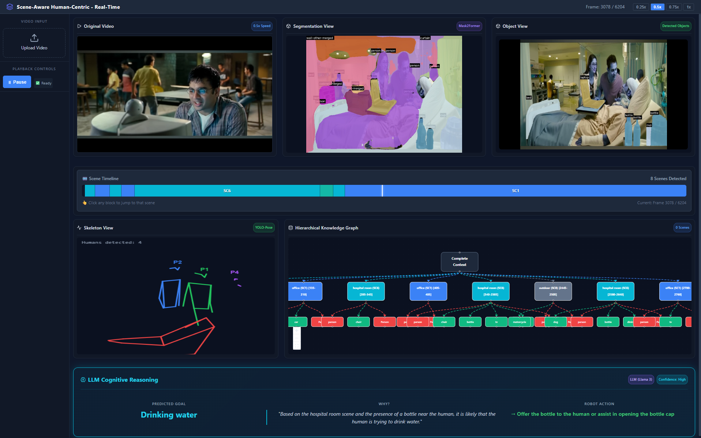
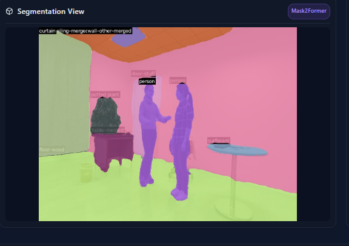
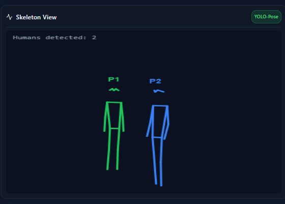
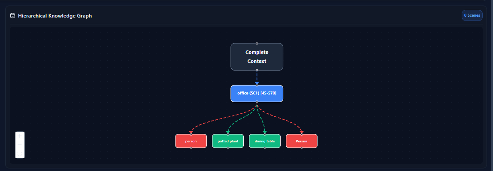
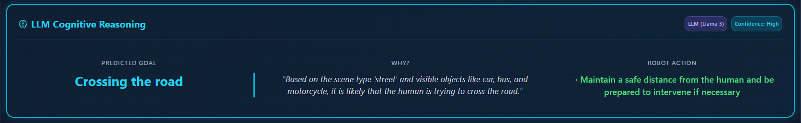
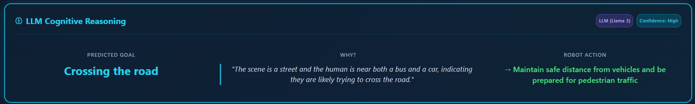

# Scene-Aware Human-Centric Real-Time Safety Monitoring System

[](https://www.python.org/)
[](https://fastapi.tiangolo.com/)
[](https://reactjs.org/)
[](LICENSE)

##  Overview

A real-time intelligent safety monitoring system that combines **computer vision**, **knowledge graphs**, and **LLM reasoning** for workplace safety analysis. This system is designed to focus on Augmented Reality (AR) and skeleton-based human activity recognition for industrial safety applications.

## 🎯 Research Context

This project supports research on:
- **Augmented Reality (AR) Safety Zones**: Real-time environment understanding with safe/danger zone detection
- **Skeleton Analysis**: Multi-person pose estimation and activity recognition using body keypoints
- **Scene-Aware Reasoning**: Context-aware safety decision making by combining human poses with environmental objects
- **Temporal Knowledge Graphs**: Structured representation of multi-step servicing tasks and scene transitions
- **LLM-Based Cognitive Reasoning**: Natural language understanding of risky situations and automated alert generation

## ✨ Key Features

### 🎥 Real-Time Video Processing
- Upload and process videos with browser-compatible H.264 conversion
- Frame-by-frame analysis with parallel processing
- Interactive playback controls with speed adjustment (0.25x - 1.0x)

### ️ Multi-View Visualization
1. **Original Video View**: Clean video playback with timeline
2. **Segmentation View**: Full panoptic segmentation (Mask2Former) showing walls, floors, objects, and people
3. **Object View**: Object-only segmentation (YOLOv8x-seg) with colored masks on natural background
4. **Skeleton View**: Real-time multi-person pose estimation (YOLOv8x-pose) with clean skeletal structure
5. **Hierarchical Knowledge Graph**: Temporal scene-object-person relationships with ReactFlow visualization
6. **Scene Timeline**: Interactive timeline showing scene transitions with click-to-seek functionality

### 🧠 AI-Powered Analysis
- **Scene Classification**: CLIP-based environment recognition (hospital, office, park, etc.)
- **Object Detection**: 80 COCO classes with instance segmentation
- **Pose Estimation**: 17-keypoint human skeleton tracking for multiple people
- **LLM Reasoning**: Llama 3.1:8b integration for cognitive safety analysis
  - Predicts human goals and intentions
  - Analyzes risky situations
  - Suggests robot assistance actions

### 📊 Interactive Features
- **Scene Timeline Scrubber**: Click any scene block to jump to that moment
- **Knowledge Graph Navigation**: Explore temporal relationships between scenes, objects, and humans
- **Real-Time Statistics**: Frame count, scene detection, object tracking metrics
- **Color-Coded Entities**: 
  - Scenes: Unique colors per scene ID (SC1-SC7+)
  - Humans: Red nodes with "P1", "P2" labels
  - Objects: Green nodes with class labels

## 🏗️ System Architecture

```text
┌─────────────────────────────────────────────────────────────┐
│                     Frontend (React + Vite)                  │
│  ┌──────────┐ ┌──────────┐ ┌──────────┐ ┌──────────────┐  │
│  │  Video   │ │Segment-  │ │  Object  │ │   Skeleton   │  │
│  │  Player  │ │ ation    │ │   View   │ │    View      │  │
│  └──────────┘ └──────────┘ └──────────┘ └──────────────┘  │
│  ┌──────────────────────────────────────────────────────┐  │
│  │        Hierarchical Knowledge Graph (ReactFlow)      │  │
│  └──────────────────────────────────────────────────────┘  │
│  ┌──────────────────────────────────────────────────────┐  │
│  │           Interactive Scene Timeline                 │  │
│  └──────────────────────────────────────────────────────┘  │
└─────────────────────────────────────────────────────────────┘
                             │
                             ▼
┌─────────────────────────────────────────────────────────────┐
│                  Backend (FastAPI + Python)                  │
│  ┌──────────────┐  ┌──────────────┐  ┌──────────────┐      │
│  │ Mask2Former  │  │   YOLOv8x    │  │   YOLOv8x    │      │
│  │ Panoptic Seg │  │ Segmentation │  │    Pose      │      │
│  └──────────────┘  └──────────────┘  └──────────────┘      │
│  ┌──────────────┐  ┌──────────────┐  ┌──────────────┐      │
│  │     CLIP     │  │   Neo4j KG   │  │  Llama 3.1   │      │
│  │ Scene Class  │  │   Builder    │  │   Reasoning  │      │
│  └──────────────┘  └──────────────┘  └──────────────┘      │
─────────────────────────────────────────────────────────────┘
```

## 📸 Screenshots

### Dashboard Overview

*Real-time multi-view dashboard with video, segmentation, object detection, and skeleton tracking*

### Segmentation Views

*Left: Full panoptic segmentation | Right: Object-only segmentation*

### Skeleton Tracking

*Multi-person pose estimation with clean skeletal structure*

### Knowledge Graph

*Temporal hierarchical knowledge graph showing scene-object-person relationships*

### Scene Timeline

*Interactive scene timeline with click-to-seek functionality*

### LLM Reasoning

*Cognitive reasoning banner showing predicted goals and safety alerts*

## 🚀 Installation

### Prerequisites
- Python 3.9 or higher
- Node.js 18+ and npm
- FFmpeg (for video conversion)
- CUDA-compatible GPU (recommended for fast inference)
- Ollama (for LLM reasoning)

### 1. Clone the Repository
```bash
git clone https://github.com/yourusername/scene-aware-safety-system.git
cd scene-aware-safety-system
```

### 2. Backend Setup
```bash
# Create virtual environment
python -m venv venv
source venv/bin/activate  # On Windows: venv\Scripts\activate

# Install dependencies
pip install -r requirements.txt

# Download YOLOv8 models
python -c "from ultralytics import YOLO; YOLO('yolov8x-seg.pt'); YOLO('yolov8x-pose.pt')"

# Install Ollama and pull Llama 3.1:8b
# Visit https://ollama.ai for installation
ollama pull llama3.1:8b
```

### 3. Neo4j Setup
```bash
# Install Neo4j (Community Edition)
# Visit https://neo4j.com/download for installation

# Start Neo4j and set password
# Default credentials: neo4j/neo4j
```

### 4. Frontend Setup
```bash
cd frontend

# Install dependencies
npm install

# Start development server
npm run dev
```

### 5. Start Backend Server
```bash
# From project root directory
cd web_dashboard
uvicorn backend:app --reload --port 8000
```

## 📖 Usage

1. **Access the Application**: Open your browser and navigate to `http://localhost:5173`

2. **Upload Video**: 
   - Click "Upload Video" in the sidebar
   - Select an MP4 video file (recommended: 720p-1080p, < 50MB)
   - Wait for H.264 conversion (if needed)

3. **Start Analysis**:
   - Click "Play" to begin video playback
   - Adjust playback speed using the speed buttons (0.25x, 0.5x, 0.75x, 1.0x)
   - Observe real-time segmentation, skeleton tracking, and object detection

4. **Interactive Features**:
   - **Scene Timeline**: Click any colored block to jump to that scene
   - **Knowledge Graph**: Hover over nodes to see details, drag to explore
   - **LLM Reasoning**: View cognitive analysis every 15 frames

5. **Export Results**:
   - Knowledge graph data is automatically saved in Neo4j
   - Processed frames are stored in `sessions/frames/`

## 🔧 Configuration

### Backend Configuration (`web_dashboard/graph/config.py`)
```python
NEO4J_URI = "bolt://localhost:7687"
NEO4J_USER = "neo4j"
NEO4J_PASSWORD = "your_password"
NEO4J_DATABASE = "neo4j"
```

### Frontend Configuration (`frontend/.env`)
```env
VITE_API_URL=http://localhost:8000
```

### Model Configuration
- **Segmentation**: `facebook/mask2former-swin-base-coco-panoptic`
- **Object Detection**: `yolov8x-seg.pt`
- **Pose Estimation**: `yolov8x-pose.pt`
- **Scene Classification**: `ViT-B-32-quickgelu` (CLIP)
- **LLM Reasoning**: `llama3.1:8b` (via Ollama)

## 📂 Project Structure

```text
scene-aware-safety-system/
├── frontend/                    # React + Vite frontend
│   ├── src/
│   │   ├── components/          # React components
│   │   │   ├── ObjectView.jsx
│   │   │   ├── SkeletonViewer.jsx
│   │   │   ├── HierarchicalGraph.jsx
│   │   │   ├── SceneTimeline.jsx
│   │   │   └── SpatialTracker.jsx
│   │   ├── App.jsx
│   │   └── main.jsx
│   ├── index.html
│   ├── package.json
│   └── vite.config.js
│
├── web_dashboard/               # FastAPI backend
│   ├── backend.py               # Main API server
│   ├── graph/
│   │   ├── config.py            # Neo4j configuration
│   │   ── inference.py         # Graph inference
│   └── sessions/                # Video uploads & processed frames
│
├── perception/                  # Computer vision modules
│   ├── depth_estimator.py
│   ├── pose_estimator.py
│   ├── dynamic_mapper.py
│   └── scene_filter.py
│
├── reasoning/                   # AI reasoning modules
│   ├── activity_inference.py
│   ├── llm_reasoner.py
│   ├── relation_engine.py
│   └── intent_engine.py
│
├── requirements.txt
├── README.md
└── screenshots/
```

## 🧪 Research Applications

This system supports various research scenarios:

### 1. **Workplace Safety Monitoring**
- Detect unsafe postures near hazardous equipment
- Track compliance with safety protocols
- Real-time AR alert generation for dangerous situations

### 2. **Multi-Step Task Recognition**
- Monitor complex servicing procedures
- Identify skipped or incorrect steps
- Provide guidance through AR interface

### 3. **Human-Robot Collaboration**
- Understand human intent for robot assistance
- Predict next actions based on pose and context
- Suggest optimal robot interventions

### 4. **Ergonomic Analysis**
- Analyze worker postures for ergonomic risks
- Track repetitive motion patterns
- Suggest posture corrections

## 📊 Performance Metrics

| Component | Model | Inference Time (GPU) | Accuracy |
|-----------|-------|---------------------|----------|
| Panoptic Segmentation | Mask2Former | ~200ms | PQ: 52.1 |
| Object Segmentation | YOLOv8x-seg | ~50ms | mAP: 53.4 |
| Pose Estimation | YOLOv8x-pose | ~40ms | mAP: 63.1 |
| Scene Classification | CLIP ViT-B/32 | ~30ms | Top-1: 78.2 |
| LLM Reasoning | Llama 3.1:8b | ~2s | - |

*Tested on NVIDIA RTX 3080, 10GB VRAM*

##  License

This project is licensed under the MIT License - see the [LICENSE](LICENSE) file for details.

## 🙏 Acknowledgments

- **Meta AI** - For Mask2Former and CLIP models
- **Ultralytics** - For YOLOv8 models
- **Meta AI & Ollama** - For Llama 3.1 model

##  References

1. Mask2Former: Cheng, B., et al. "Masked-attention Mask Transformer for Universal Image Segmentation." CVPR 2022.
2. YOLOv8: Ultralytics. "YOLOv8 Documentation." https://docs.ultralytics.com
3. CLIP: Radford, A., et al. "Learning Transferable Visual Models From Natural Language Supervision." ICML 2021.
4. Llama 3.1: Meta AI. "Llama 3.1 Model Card." https://ollama.ai
5. Neo4j: Webber, J. "Neo4j in Action." Manning Publications, 2017.
